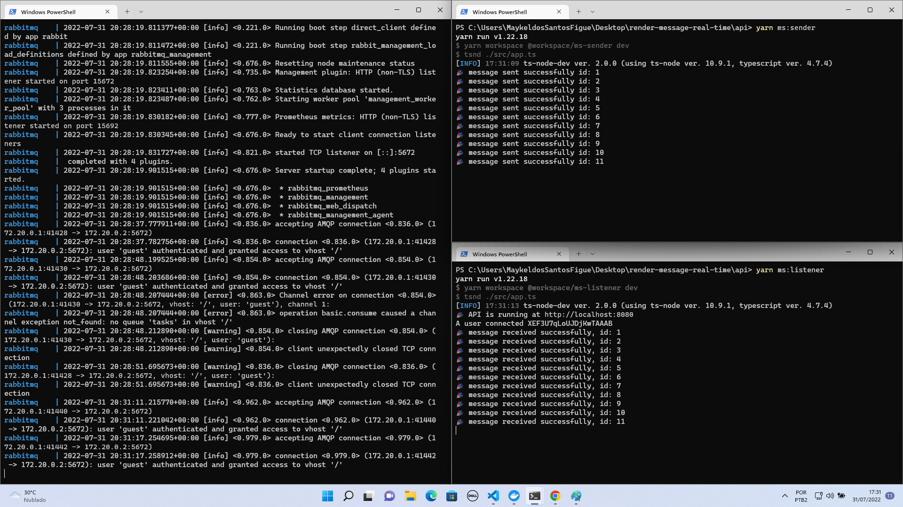
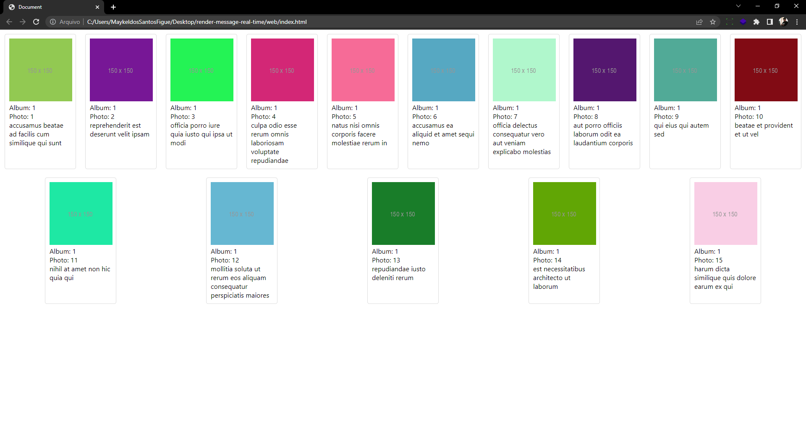

<!-- PROJECT SHIELDS -->
<!-- ... -->

<!--
*** Estamos usando "reference style" do markdown para links por legibilidade.
*** Os links de referência são usados entre chaves [ ] ao invés de parênteses ( ).
*** @see https://www.markdownguide.org/basic-syntax/#reference-style-links
-->

<!-- RESUMO -->
<br />
<p align="center">
  <h1 align="center">Render message in real-time</h1>
  <br />
</p>

## 🚀 Como usar

Essas instruções permitirão que você obtenha uma cópia do projeto em operação na sua máquina local para fins de desenvolvimento e teste.

### 🔧 Instalando

Precisamos de algumas etapas para configurar o projeto.

Instale as dependências do projeto

```
yarn or yarn install
```

Em seguida execute o rabbitMQ, você pode usar a opção do "dockerizada" da aplicação

```
yarn rabbitmq-go
```

Para executar a aplicação execute

```
yarn ms:listener
yarn ms:sender
```



Abra a aplicação web e execute o arquivo ```index.html```

